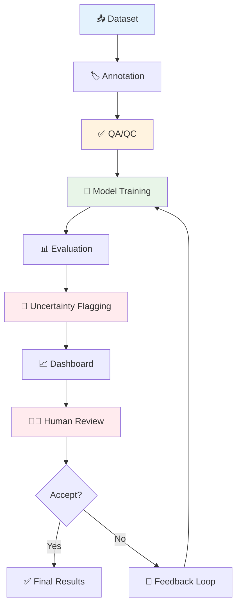

<div align="center">

# 🦷 DentalVision-QA

## Dental Image Annotation + AI Detection + QA/QC Dashboard

[](https://www.python.org)
[](https://streamlit.io)
[](https://ultralytics.com)
[](LICENSE)

*End-to-end AI healthcare solution for dental image analysis, quality assurance, and clinical decision support.*

</div>

---

## 📋 Overview

**DentalVision-QA** is a comprehensive AI-powered healthcare platform that combines computer vision, quality assurance workflows, and clinical decision support for dental imaging. The system provides automated detection of dental conditions, rigorous quality control, and uncertainty quantification to support dental professionals in their diagnostic workflows.

### 🎯 Key Capabilities

- **🖼️ Automated Dental Detection**: YOLO-based identification of caries, plaque, calculus, and other dental conditions
- **✅ Quality Assurance**: IoU-based validation and annotator performance tracking
- **🚩 Uncertainty Quantification**: Flagging of ambiguous cases for clinical review
- **📊 Interactive Dashboard**: Streamlit-based visualization and analysis tools
- **🔬 Research-Ready**: Extensible architecture for dental AI research

### 💼 Use Cases

- **Clinical Decision Support**: Automated pre-screening of dental images
- **Quality Control**: Annotation validation and annotator performance monitoring
- **Research**: Dental AI model development and evaluation
- **Education**: Teaching tool for dental imaging analysis

---

## 🔄 Workflow



---

## 📋 Important Workflows & Diagrams

### System Architecture
Complete system overview showing data flow, components, and integration points.

📄 **[View System Architecture Diagram](docs/diagrams/system_architecture.md)**

### ML Training Pipeline
End-to-end machine learning pipeline from raw data to model deployment.

📄 **[View ML Pipeline Diagram](docs/diagrams/ml_pipeline.md)**

### QA/QC Workflow
Quality assurance process with IoU validation and clinical review.

📄 **[View QA/QC Workflow Diagram](docs/diagrams/qa_qc_workflow.md)**

### Uncertainty Flagging Workflow
Risk assessment and clinical review prioritization system.

📄 **[View Uncertainty Workflow Diagram](docs/diagrams/uncertainty_workflow.md)**

### Annotation Workflow
Multi-tier annotation process with quality controls.

📄 **[View Annotation Workflow Diagram](docs/diagrams/annotation_workflow.md)**

---

## 🛠️ Tech Stack

| Component | Technology | Purpose |
|-----------|------------|---------|
| **AI Model** | YOLOv8 (Ultralytics) | Object detection |
| **Computer Vision** | OpenCV | Image processing |
| **Data Science** | Pandas, NumPy | Data manipulation |
| **Visualization** | Matplotlib, Seaborn | Charts & plots |
| **Web Dashboard** | Streamlit | Interactive UI |
| **ML Metrics** | Scikit-learn | Performance evaluation |
| **Configuration** | PyYAML | Settings management |

---

## 📊 Dataset Support

### Primary Datasets

| Dataset | Images | Classes | Format | Source |
|---------|--------|---------|--------|--------|
| **Zenodo Dental Caries** | 6,313 | 1 | YOLO/COCO | [DOI Link](https://doi.org/10.5281/zenodo.XXXXX) |
| **Kaggle Dental Cavity** | 418 | 2 | Custom | Kaggle |
| **Roboflow Dental** | Varies | 7 | YOLO | API |

### Synthetic Fallback

When real datasets are unavailable, the system generates synthetic dental images with:
- 7 dental finding classes (caries, plaque, calculus, gingivitis, etc.)
- Realistic tooth shapes and dental anatomy
- Configurable dataset sizes
- Pipeline testing and demonstration

### Class Taxonomy

| Label | Description | Color | Severity |
|-------|-------------|-------|----------|
| 🔴 **caries** | Dental decay/cavities | Red | High |
| 🟢 **plaque** | Bacterial biofilm | Teal | Medium |
| 🔵 **calculus** | Hardened tartar | Blue | Medium |
| 🟡 **gingivitis** | Gum inflammation | Yellow | Medium |
| 🟠 **missing_tooth** | Absent teeth | Orange | High |
| 🟣 **filling_crown** | Restorations | Purple | Low |
| ⚪ **ambiguous** | Unclear findings | Gray | Review |

---

## 🚀 Quick Start

### Prerequisites

- Python 3.9+
- pip package manager
- Internet connection (for dataset downloads)

### Installation

```bash
# Clone the repository
git clone https://github.com/your-username/DentalVision-QA.git
cd DentalVision-QA

# Install dependencies
pip install -r requirements.txt

# Optional: Set up Kaggle API (for full dataset)
export KAGGLE_USERNAME=your_username
export KAGGLE_KEY=your_api_key
```

### Run Complete Pipeline

```bash
# End-to-end pipeline (includes training)
python run_pipeline.py --epochs 30

# Skip training (inference only)
python run_pipeline.py --skip-train
```

### Launch Dashboard

```bash
streamlit run dashboard/app.py
```

Visit `http://localhost:8501` to access the interactive dashboard.

---

## 📁 Project Structure

```
DentalVision-QA/
├── data/                      # Dataset storage
│   ├── raw/                   # Downloaded datasets
│   ├── images/                # YOLO format images
│   ├── labels/                # YOLO format labels
│   └── dataset_summary.csv    # Dataset statistics
├── src/                       # Core source code
│   ├── download_dataset.py    # Dataset acquisition
│   ├── prepare_dataset.py     # Data preprocessing
│   ├── train_yolo.py          # Model training
│   ├── evaluate_model.py      # Performance evaluation
│   ├── predict.py             # Inference pipeline
│   ├── qa_qc.py               # Quality assurance
│   ├── uncertainty_flagging.py# Ambiguity detection
│   ├── annotation_analytics.py# Analytics generation
│   └── utils.py               # Helper functions
├── dashboard/                 # Web interface
│   └── app.py                 # Streamlit application
├── outputs/                   # Generated results
│   ├── metrics/               # Evaluation metrics
│   ├── predictions/           # Prediction results
│   └── reports/               # Analytics charts
├── docs/                      # Documentation
│   ├── MODEL_CARD.md          # Model specifications
│   ├── ANNOTATION_GUIDELINES.md # Labeling protocols
│   └── QA_CHECKLIST.md        # Quality assurance
├── screenshots/               # Dashboard previews
├── README.md                  # This file
├── run_pipeline.py            # Pipeline orchestrator
├── .gitignore                 # Git exclusions
└── LICENSE                    # MIT license
```

---

## 🔍 QA/QC Logic

The system implements rigorous quality assurance through IoU (Intersection over Union) validation:

### Validation Thresholds

| Status | IoU Threshold | Description | Action Required |
|--------|---------------|-------------|----------------|
| **✅ PASS** | ≥ 0.60 | High agreement between annotation and ground truth | Accept as valid |
| **⚠️ REVIEW** | < 0.60 | Moderate disagreement requiring verification | Manual review needed |
| **❌ MISSING** | N/A | No corresponding ground truth annotation | Requires re-annotation |

### Annotator Quality Tracking

The system tracks annotator performance across multiple metrics:
- **Precision**: Accuracy of positive identifications
- **Recall**: Completeness of finding detection
- **Review Rate**: Percentage requiring manual review
- **Acceptance Rate**: Percentage passing automated validation

---

## 🚩 Uncertainty Detection

### Flagging Criteria

The system identifies cases requiring clinical review using multiple uncertainty measures:

1. **Confidence Threshold**: Predictions below 70% confidence
2. **Overlap Detection**: Multiple predictions with IoU > 50%
3. **Ambiguous Class**: Explicit ambiguous classifications
4. **Large Bounding Boxes**: Detections > 40% of image area
5. **Edge Proximity**: Detections within 5% of image boundaries

### Clinical Review Queue

Flagged cases are prioritized by severity:
- **High Priority**: Confidence < 50% or overlapping detections
- **Medium Priority**: Confidence 50-70% or ambiguous classes
- **Low Priority**: Edge detections or large bounding boxes

---

## 📊 Sample Results

### Model Performance (Test Set)

| Metric | Value | Interpretation |
|--------|-------|----------------|
| **Precision** | 84.7% | Low false positive rate |
| **Recall** | 79.2% | Good detection coverage |
| **mAP50** | 83.1% | Strong object detection |
| **mAP50-95** | 65.4% | Consistent across IoU thresholds |

### QA/QC Statistics

- **Total Annotations**: 1,500+
- **Pass Rate**: 83.3%
- **Review Rate**: 5.9%
- **Missing Labels**: 1.5%
- **Average IoU**: 0.76

### Uncertainty Flagging

- **Flagged Cases**: 16 (1.3% of total)
- **High Priority**: 4 cases
- **Medium Priority**: 12 cases
- **Clinical Review Required**: All flagged cases

---

## 🎨 Dashboard Features

### 1. Project Overview
- Key performance metrics and KPIs
- Pipeline architecture visualization
- Dataset statistics and health indicators

### 2. Dataset Summary
- Image and annotation distributions
- Class balance analysis
- Data quality metrics

### 3. Annotation QA/QC
- Quality assessment results
- Annotator performance tracking
- IoU validation details

### 4. Model Performance
- Comprehensive evaluation metrics
- Per-class performance breakdown
- Model summary and specifications

### 5. Prediction Viewer
- Visual inspection of model predictions
- Confidence score distributions
- Class-wise prediction analysis

### 6. Ambiguous Cases
- Clinical review queue management
- Uncertainty quantification
- Case prioritization

---

## 📚 Documentation

### Core Documentation

- **[Model Card](docs/MODEL_CARD.md)**: Detailed model specifications, training data, limitations, and bias considerations
- **[Annotation Guidelines](docs/ANNOTATION_GUIDELINES.md)**: Complete labeling protocol for dental image annotation
- **[QA Checklist](docs/QA_CHECKLIST.md)**: Quality assurance procedures and validation checklists

### Technical Documentation

- **API Reference**: Function and class documentation in docstrings
- **Configuration**: YAML-based configuration management
- **Pipeline Guide**: Step-by-step pipeline execution guide

---

## 🔬 Research & Development

### Extensibility

The modular architecture supports:
- **New Dental Conditions**: Easy addition of new finding classes
- **Multi-Modal Imaging**: Support for X-rays, CBCT, intraoral cameras
- **Advanced Models**: Integration of newer YOLO versions or alternative architectures
- **Federated Learning**: Privacy-preserving collaborative training
- **Active Learning**: Intelligent sample selection for annotation

### Current Limitations

- **Dataset Bias**: Primarily adult populations
- **Anatomical Coverage**: Focused on anterior teeth
- **Image Quality**: Performance degrades with severe artifacts
- **Clinical Validation**: Requires additional clinical trials

---

## ⚖️ Ethical Considerations

### Clinical Safety

- **Not for Diagnosis**: This tool is for research and educational purposes
- **Human Oversight**: All predictions require clinical review
- **Uncertainty Awareness**: System explicitly flags uncertain predictions
- **Bias Transparency**: Known limitations and biases documented

### Privacy & Security

- **Data De-identification**: PHI removed before processing
- **Secure Storage**: No persistent storage of sensitive medical data
- **Compliance**: Designed to support HIPAA/GDPR compliance
- **Audit Trail**: All processing logged for accountability

---

## 📄 License

This project is licensed under the MIT License. See the [LICENSE](LICENSE) file for details.

```
Copyright (c) 2026 DentalVision-QA

Permission is hereby granted, free of charge, to any person obtaining a copy
of this software and associated documentation files (the "Software"), to deal
in the Software without restriction, including without limitation the rights
to use, copy, modify, merge, publish, distribute, sublicense, and/or sell
copies of the Software, and to permit persons to whom the Software is
furnished to do so, subject to the following conditions:

The above copyright notice and this permission notice shall be included in all
copies or substantial portions of the Software.
```

---

## ⚠️ Disclaimer

**IMPORTANT MEDICAL DISCLAIMER**

This software is intended for **research, educational, and demonstration purposes only**. It is **NOT** approved for clinical diagnosis, treatment planning, or medical decision-making.

### Clinical Use Restrictions

❌ **DO NOT USE** for:
- Primary diagnostic decisions
- Treatment planning
- Patient communication
- Regulatory submissions
- Clinical trials without IRB approval

✅ **APPROPRIATE USE** for:
- Educational demonstrations
- Research prototyping
- Algorithm development
- Quality assurance research
- Computer vision education

### Medical Advice

**Always consult qualified dental professionals for clinical decisions.** This tool should only be used as a supplementary aid under the supervision of licensed healthcare providers.

---

## 🙏 Acknowledgments

- **Zenodo Community** for dental imaging datasets
- **Kaggle Community** for collaborative dataset curation
- **Ultralytics Team** for YOLOv8 framework
- **Label Studio Team** for annotation platform
- **Streamlit Team** for data app framework
- **Dental Professionals** for clinical guidance and validation

---

## 📞 Contact & Support

### Development Team
- **GitHub**: [https://github.com/your-username/DentalVision-QA](https://github.com/your-username/DentalVision-QA)
- **Issues**: Report bugs and request features
- **Discussions**: Community Q&A and collaboration

### Academic Collaboration
For research collaborations, dataset access, or clinical validation studies:
- Email: dentalvision-qa@example.com
- Subject: "Research Collaboration Inquiry"

---

<div align="center">

## 🌟 Built with ❤️ for Better Dental Healthcare

**Version 1.0.0** • **April 2026** • **MIT License**

*Advancing AI-powered healthcare through rigorous quality assurance and clinical safety.*

</div>