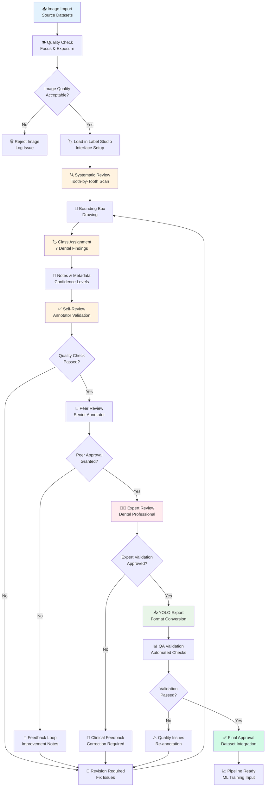

# Annotation Workflow

## Dental Image Annotation Workflow

### Annotation Process Overview

The dental image annotation workflow ensures high-quality, clinically relevant annotations through a multi-tiered review process and automated quality validation.

### Workflow Stages

#### 1. Image Acquisition & Quality Control
- **Source**: Multiple dental image datasets (Zenodo, Kaggle, etc.)
- **Quality Check**: Focus, exposure, field of view, anatomical landmarks
- **Rejection Criteria**: Blurry images, poor lighting, incomplete anatomy
- **Acceptance Rate**: Target >90% of imported images

#### 2. Annotation Execution
- **Tool**: Label Studio interface with dental-specific configuration
- **Methodology**: Systematic quadrant-by-quadrant tooth-by-tooth review
- **Classes**: 7 dental findings with specific clinical definitions
- **Documentation**: Confidence levels, uncertainty notes, special cases

#### 3. Quality Assurance Layers

##### Self-Review (Annotator Level)
- **Completeness**: All visible findings annotated
- **Accuracy**: Correct class assignment and bounding box placement
- **Consistency**: Adherence to annotation guidelines
- **Documentation**: Adequate notes for complex cases

##### Peer Review (Senior Annotator)
- **Technical Quality**: Bounding box precision and class accuracy
- **Clinical Relevance**: Appropriate clinical judgment and flagging
- **Guideline Compliance**: Consistent application of protocols
- **Training Needs**: Identification of knowledge gaps

##### Expert Review (Licensed Dentist)
- **Clinical Validity**: Dental expertise validation
- **Diagnostic Accuracy**: Correct identification of findings
- **Edge Cases**: Complex or ambiguous clinical scenarios
- **Quality Standards**: Compliance with clinical best practices

#### 4. Format Conversion & Validation
- **Export**: YOLO format with normalized coordinates
- **Validation**: Automated checks for format compliance
- **Integration**: Seamless pipeline integration
- **Archiving**: Secure storage with metadata preservation

### Annotation Classes

| Class | Description | Color | Clinical Priority |
|-------|-------------|-------|-------------------|
| Caries | Dental decay/cavities | Red | High |
| Plaque | Bacterial biofilm | Teal | Medium |
| Calculus | Hardened tartar | Blue | Medium |
| Gingivitis | Gum inflammation | Green | Medium |
| Missing Tooth | Absent teeth | Orange | High |
| Filling/Crown | Restorations | Purple | Low |
| Ambiguous | Unclear findings | Gray | Review |

### Quality Metrics

#### Process Metrics
- **Annotation Time**: Average 15-25 minutes per image
- **Review Rate**: 10-20% require peer review
- **Expert Consultation**: 5-10% need clinical validation
- **Acceptance Rate**: Target >85% first-pass approval

#### Quality Metrics
- **Intra-annotator Agreement**: κ > 0.85 (Cohen's Kappa)
- **Inter-annotator Agreement**: κ > 0.80
- **Clinical Accuracy**: >90% agreement with dental experts
- **Bounding Box Precision**: ±2-3 pixels accuracy

### Training & Certification

#### Initial Training (40 hours)
- **Platform Familiarization**: Label Studio interface and shortcuts
- **Clinical Knowledge**: Dental anatomy and pathology
- **Annotation Practice**: Guided exercises with expert feedback
- **Quality Standards**: Review criteria and common pitfalls

#### Certification Process
- **Written Assessment**: Clinical knowledge and guideline comprehension
- **Practical Examination**: Annotate test images under supervision
- **Calibration Sessions**: Work alongside experienced annotators
- **Final Evaluation**: Achieve >90% accuracy on validation set

#### Continuing Education
- **Monthly Refreshers**: Updated guidelines and edge cases
- **Peer Learning**: Case discussions and best practice sharing
- **Performance Monitoring**: Ongoing quality assessment
- **Feedback Integration**: Continuous improvement based on reviews

### Tools & Technology

#### Primary Tools
- **Label Studio**: Web-based annotation interface
- **YOLO Format**: Standardized object detection format
- **Quality Validation**: Automated checking scripts
- **Review Dashboard**: Centralized quality monitoring

#### Supporting Technology
- **Image Management**: Secure storage and access controls
- **Quality Metrics**: Automated calculation and reporting
- **Training Platform**: Online learning modules and assessments
- **Audit Trail**: Complete annotation history and changes

### Challenges & Solutions

#### Common Challenges
- **Interpreting Ambiguous Cases**: Clear escalation protocols
- **Maintaining Consistency**: Regular calibration sessions
- **Handling Complex Anatomy**: Expert consultation pathways
- **Time Pressure**: Balanced quality vs. efficiency goals

#### Mitigation Strategies
- **Comprehensive Training**: Thorough initial and ongoing education
- **Clear Guidelines**: Detailed protocols with examples
- **Quality Monitoring**: Multi-tier review process
- **Feedback Loops**: Continuous improvement mechanisms

### Integration with ML Pipeline

#### Data Preparation
- **Format Conversion**: Automated YOLO format generation
- **Quality Filtering**: Only approved annotations enter training
- **Metadata Preservation**: Complete annotation history maintained
- **Version Control**: Track annotation versions and changes

#### Model Training Impact
- **Data Quality**: High-quality annotations improve model performance
- **Consistency**: Standardized annotations reduce training noise
- **Clinical Relevance**: Expert-validated labels ensure medical accuracy
- **Scalability**: Efficient process supports large dataset creation

### Benefits

- **Clinical Accuracy**: Expert-validated annotations ensure medical relevance
- **Quality Assurance**: Multi-tier review prevents errors and inconsistencies
- **Efficiency**: Streamlined process with automated quality checks
- **Scalability**: Standardized workflow supports large-scale annotation projects
- **Continuous Improvement**: Feedback loops enhance quality over time
- **Training Pipeline**: Direct integration with ML model development