# ML Pipeline

## DentalVision-QA Machine Learning Pipeline

```mermaid
flowchart LR
    A[📥 Raw Dental Images<br>Multiple Sources] --> B[🏷️ Label Studio<br>Annotation]
    B --> C[📤 YOLO Format<br>Export]
    C --> D[🔄 Data Preparation<br>Preprocessing]
    D --> E[✂️ Train/Val/Test<br>Split 70/20/10]
    E --> F[🤖 YOLOv8 Training<br>Model Development]
    F --> G[📊 Model Evaluation<br>Metrics Calculation]
    G --> H[🎯 Prediction Engine<br>Inference Pipeline]
    H --> I[📈 Dashboard<br>Visualization]

    subgraph "Data Sources"
        A
    end

    subgraph "Annotation"
        B --> C
    end

    subgraph "Preprocessing"
        D --> E
    end

    subgraph "Model Development"
        F --> G
    end

    subgraph "Deployment"
        H --> I
    end

    style A fill:#e3f2fd
    style B fill:#fff3e0
    style F fill:#e8f5e8
    style I fill:#e8f5e8
```

### Pipeline Stages

#### 1. Data Acquisition
- **Sources**: Zenodo, Kaggle, Roboflow, Synthetic
- **Formats**: JPEG, PNG images with annotations
- **Validation**: Image integrity and format checks

#### 2. Annotation Process
- **Tool**: Label Studio interface
- **Classes**: 7 dental findings (caries, plaque, etc.)
- **Output**: YOLO format bounding boxes and labels

#### 3. Data Preparation
- **Format Conversion**: All annotations to YOLO format
- **Preprocessing**: Image resizing, normalization
- **Augmentation**: Mosaic, MixUp, HSV transforms

#### 4. Dataset Splitting
- **Training**: 70% for model training
- **Validation**: 20% for hyperparameter tuning
- **Testing**: 10% for final evaluation

#### 5. Model Training
- **Architecture**: YOLOv8 nano/small/medium
- **Framework**: PyTorch with Ultralytics
- **Hardware**: CPU/GPU with MPS support

#### 6. Model Evaluation
- **Metrics**: Precision, Recall, mAP@50, mAP@50-95
- **Validation**: Test set performance assessment
- **Thresholds**: Clinical acceptability checks

#### 7. Prediction Pipeline
- **Inference**: Real-time object detection
- **Post-processing**: NMS, confidence filtering
- **Output**: Bounding boxes with class probabilities

#### 8. Dashboard Integration
- **Visualization**: Streamlit-based interactive UI
- **Analytics**: Performance metrics and insights
- **Reports**: Automated generation and export

### Key Features

- **Modular Design**: Each stage can be run independently
- **Error Handling**: Graceful failure and recovery mechanisms
- **Scalability**: Support for different dataset sizes
- **Reproducibility**: Fixed seeds and version control
- **Monitoring**: Logging and performance tracking

### Quality Gates

- **Data Quality**: Image validation and annotation consistency
- **Model Quality**: Convergence monitoring and validation metrics
- **Pipeline Quality**: Error rates and processing efficiency
- **Output Quality**: Prediction accuracy and clinical relevance