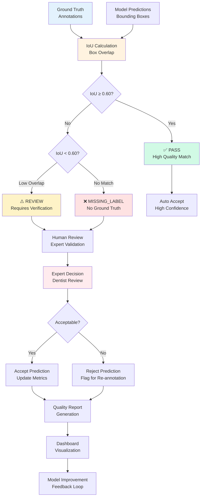

# QA/QC Workflow

## Quality Assurance and Quality Control Workflow

### QA/QC Process Overview

The Quality Assurance and Quality Control system evaluates the accuracy of model predictions against ground truth annotations using Intersection over Union (IoU) metrics.

### Validation Thresholds

| IoU Score | Status | Action | Clinical Impact |
|-----------|--------|--------|----------------|
| ≥ 0.60 | ✅ PASS | Auto-accept | High confidence |
| < 0.60 | ⚠️ REVIEW | Human review | Moderate risk |
| 0.00 | ❌ MISSING | Re-annotation | High risk |

### Workflow Steps

#### 1. Input Collection
- **Ground Truth**: Expert-annotated dental images
- **Predictions**: Model-generated bounding boxes and classes
- **Metadata**: Image IDs, timestamps, annotator information

#### 2. IoU Calculation
- **Box Comparison**: Calculate overlap between predicted and ground truth boxes
- **Class Matching**: Ensure predictions match correct dental finding classes
- **Scoring**: Generate IoU scores for each prediction-ground truth pair

#### 3. Status Assignment
- **PASS**: IoU ≥ 0.60 (high agreement, auto-accept)
- **REVIEW**: IoU < 0.60 (low agreement, human review required)
- **MISSING_LABEL**: No matching ground truth (potential false positive)

#### 4. Human Review Process
- **Expert Review**: Licensed dentists evaluate flagged cases
- **Decision Making**: Accept, reject, or request re-annotation
- **Documentation**: Review notes and decision rationale

#### 5. Quality Reporting
- **Metrics Generation**: Precision, recall, F1-score calculations
- **Trend Analysis**: Performance over time and across annotators
- **Issue Identification**: Common error patterns and root causes

#### 6. Feedback Loop
- **Model Improvement**: Use QA results to guide retraining
- **Process Optimization**: Identify and fix annotation bottlenecks
- **Quality Enhancement**: Continuous improvement of annotation protocols

### Quality Metrics

#### Primary Metrics
- **Precision**: True positives / (True positives + False positives)
- **Recall**: True positives / (True positives + False negatives)
- **F1 Score**: Harmonic mean of precision and recall
- **IoU Distribution**: Average overlap scores across predictions

#### Process Metrics
- **Review Rate**: Percentage of predictions requiring human review
- **Acceptance Rate**: Percentage of reviewed predictions accepted
- **Processing Time**: Average time for human review decisions
- **Inter-rater Agreement**: Consistency between expert reviewers

### Benefits

- **Clinical Safety**: Ensures high accuracy before clinical use
- **Quality Control**: Maintains consistent annotation standards
- **Efficiency**: Automated validation reduces manual workload
- **Continuous Improvement**: Data-driven quality enhancement
- **Risk Mitigation**: Identifies and addresses potential errors

### Integration Points

- **Model Training**: QA results inform model retraining priorities
- **Annotation Workflow**: Feedback improves annotator performance
- **Clinical Deployment**: Quality thresholds ensure safe clinical use
- **Dashboard**: Real-time quality monitoring and reporting