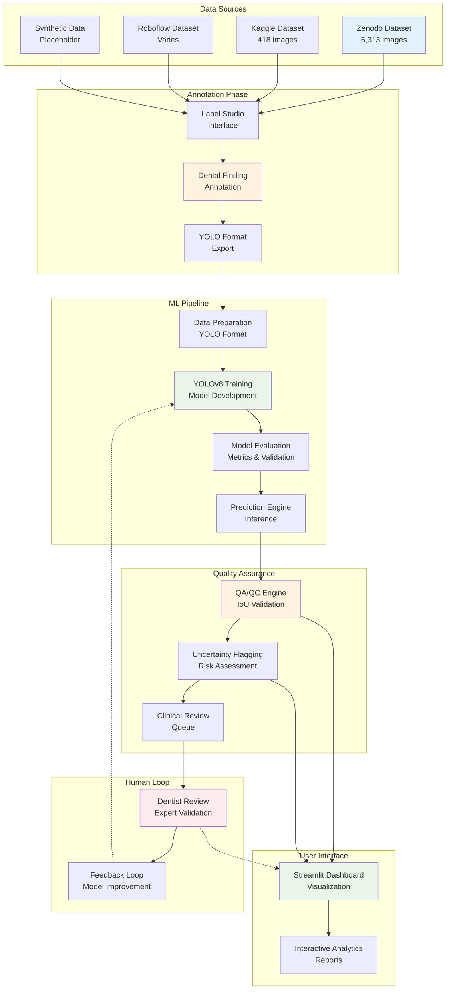

# System Architecture

## DentalVision-QA System Architecture

### Architecture Overview

- **Data Layer**: Multi-source dataset integration with fallback options
- **Annotation Layer**: Label Studio-based dental finding annotation
- **ML Layer**: YOLOv8 training and inference pipeline
- **QA Layer**: Automated quality assessment and uncertainty quantification
- **UI Layer**: Interactive dashboard for visualization and analysis
- **Human Layer**: Clinical expert review and feedback loop

### Key Components

1. **Dataset Sources**: Zenodo, Kaggle, Roboflow, Synthetic
2. **Annotation Tool**: Label Studio with 7 dental finding classes
3. **ML Framework**: YOLOv8 for object detection
4. **QA Engine**: IoU-based validation with clinical thresholds
5. **Dashboard**: Streamlit-based healthcare UI
6. **Human Loop**: Dentist review for uncertain cases

### Data Flow

1. Raw dental images from multiple sources
2. Annotation using Label Studio interface
3. Data preparation and YOLO format conversion
4. Model training and evaluation
5. Prediction with QA/QC validation
6. Uncertainty flagging and clinical review
7. Dashboard visualization and reporting
8. Human feedback loop for model improvement