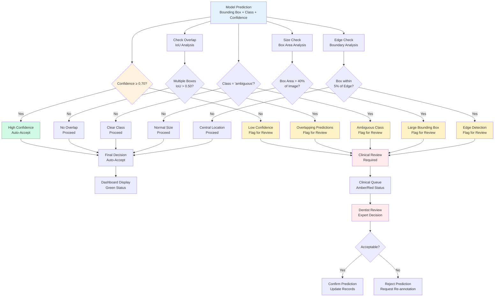

# Uncertainty Workflow

## Uncertainty Quantification and Flagging Workflow

### Uncertainty Quantification Process

The uncertainty flagging system identifies predictions that require human clinical review based on multiple risk factors and quality indicators.

### Flagging Criteria

#### 1. Confidence Threshold
- **High Confidence** (≥0.70): Auto-accept with minimal risk
- **Low Confidence** (<0.70): Flag for clinical review
- **Rationale**: Empirical threshold based on clinical acceptability

#### 2. Prediction Overlap
- **IoU Analysis**: Check for overlapping bounding boxes
- **Threshold**: IoU > 0.50 between predictions
- **Risk**: Conflicting detections may indicate uncertainty

#### 3. Class Ambiguity
- **Ambiguous Class**: Explicit "ambiguous" predictions
- **Risk**: Model acknowledges uncertainty in classification
- **Action**: Always flag for expert review

#### 4. Bounding Box Size
- **Large Boxes**: Area > 40% of image
- **Risk**: Overly aggressive detection may be artifact
- **Threshold**: Clinically reasonable size limits

#### 5. Edge Proximity
- **Edge Detection**: Boxes within 5% of image boundaries
- **Risk**: Boundary artifacts or incomplete anatomy
- **Safety**: Conservative edge margins

### Risk Levels

| Combination | Severity | Action | Timeline |
|-------------|----------|--------|----------|
| Single Flag | Low | Review | Within 24h |
| Multiple Flags | Medium | Priority Review | Within 8h |
| Critical + Low Conf | High | Urgent Review | Within 2h |

### Clinical Review Process

#### Review Queue Prioritization
1. **High Priority**: Low confidence + multiple flags
2. **Medium Priority**: Single flag conditions
3. **Low Priority**: Edge cases and minor issues

#### Expert Decision Options
- **Accept**: Confirm prediction as clinically valid
- **Reject**: Mark as false positive, remove from records
- **Re-annotate**: Request new ground truth annotation
- **Escalate**: Forward to senior clinician or committee

### Quality Metrics

#### Flagging Statistics
- **Flag Rate**: Percentage of predictions requiring review
- **False Positive Rate**: Incorrectly flagged predictions
- **Review Turnaround**: Average time for clinical decisions
- **Expert Agreement**: Consistency between reviewers

#### Clinical Outcomes
- **Safety Score**: Reduction in potential clinical errors
- **Efficiency Gain**: Automated handling of high-confidence cases
- **Quality Improvement**: Data-driven model and process enhancement

### Integration with QA/QC

- **Complementary Systems**: Uncertainty flagging works alongside IoU-based QA
- **Multi-layer Safety**: Different validation approaches provide redundancy
- **Feedback Loop**: Review outcomes inform future flagging thresholds

### Benefits

- **Clinical Safety**: Identifies cases needing expert attention
- **Efficiency**: Automates review of high-confidence predictions
- **Quality Assurance**: Multiple validation layers ensure accuracy
- **Continuous Learning**: Review data improves model performance
- **Risk Mitigation**: Systematic approach to uncertainty management

### Dashboard Integration

- **Real-time Monitoring**: Live flagging statistics and trends
- **Review Queue**: Prioritized case management interface
- **Performance Analytics**: Review efficiency and quality metrics
- **Audit Trail**: Complete record of decisions and rationales